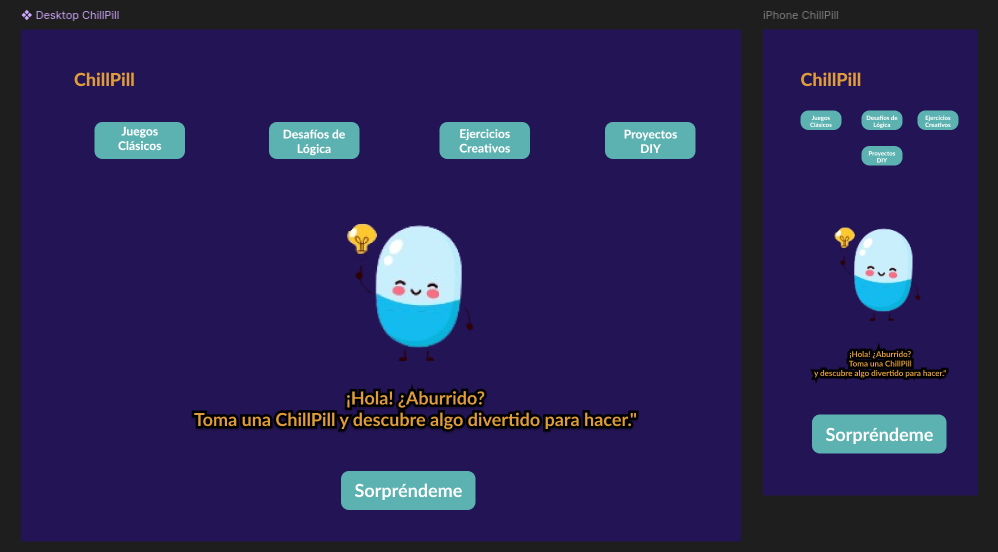

# Chill Pill  
Chill Pill es una aplicación web creada con Svelte para ofrecer actividades divertidas y creativas a las personas que buscan combatir el aburrimiento. Al hacer clic en "Sorpréndeme", la app sugiere una actividad aleatoria o una frase divertida de Chuck Norris.

Aunque inicialmente estaba planeado usar la [Bored API](https://bored-api.appbrewery.com/) para las sugerencias de actividades, debido a algunos problemas técnicos, he utilizado la API de Chuck Norris temporalmente. En futuras versiones, planeo desarrollar una API propia para mejorar la experiencia y tener mayor control sobre el contenido.

## Vista previa de la aplicación  
  


## Enlaces Útiles  
- **Diseño en Figma**: [Ver diseño](https://www.figma.com/design/IWcxhcdCVVLnWD2o5eKw2u/Chill-Pill?node-id=0-1&node-type=canvas&t=sByL9MaZBpwaPiGT-0)  

- **Aplicación en Vercel**: [Ver aplicación](https://chill-pill-a1jx7vmhn-jhoanavicentes-projects.vercel.app)

- **Tablero de Trello**:  [Ver el progreso en Trello](https://trello.com/b/q5W49Uvb/prova-frontend-hackato-salo-ocupacio).  

## Requisitos 
- Node.js (v14 o superior)
- Git  

## Tecnologías Utilizadas  
**Frontend**: Svelte  
**Estilos**: CSS  
**API**: [Chuck Norris API](https://api.chucknorris.io/)  
**Proxy Server**: Express, Axios, y Cors (para manejar CORS y llamadas API)

## Instalación  
1. Clonar el repositorio: 
```bash
git clone https://github.com/JhoanaVicente/chill_pill.git
cd chill_pill
```
2. Instalar las dependencias:  
```bash  
npm install
```  

3. Ejecución en desarrollo:  
```bash  
npm run dev  
```  
## Herramientas Recomendadas  
Si usas Visual Studio Code, se recomienda instalar la extensión oficial de Svelte para mejor soporte de sintaxis y sugerencias de código.  

## Configuración del Proxy  
Este proyecto utiliza un servidor proxy para manejar las solicitudes a la API de Bored y evitar problemas de CORS. 

### Instrucciones para Configurar el Proxy

1. **Instalar Dependencias**: Asegúrate de tener `express`, `axios` y `cors` instalados en tu servidor proxy. Puedes instalarlos usando:
   ```bash
   npm install express axios cors  
   ``` 
2. **Ejecutar el Servidor Proxy**: Inicia el servidor proxy ejecutando:  
   ```bash  
   node server.js  
   ``` 
3. **Uso en el Frontend**: En el código de tu frontend, asegúrate de que todas las solicitudes a la API de Bored pasen a través del proxy:  
   ```bash  
   const response = await fetch('http://localhost:5000/api/activity');
   ``` 