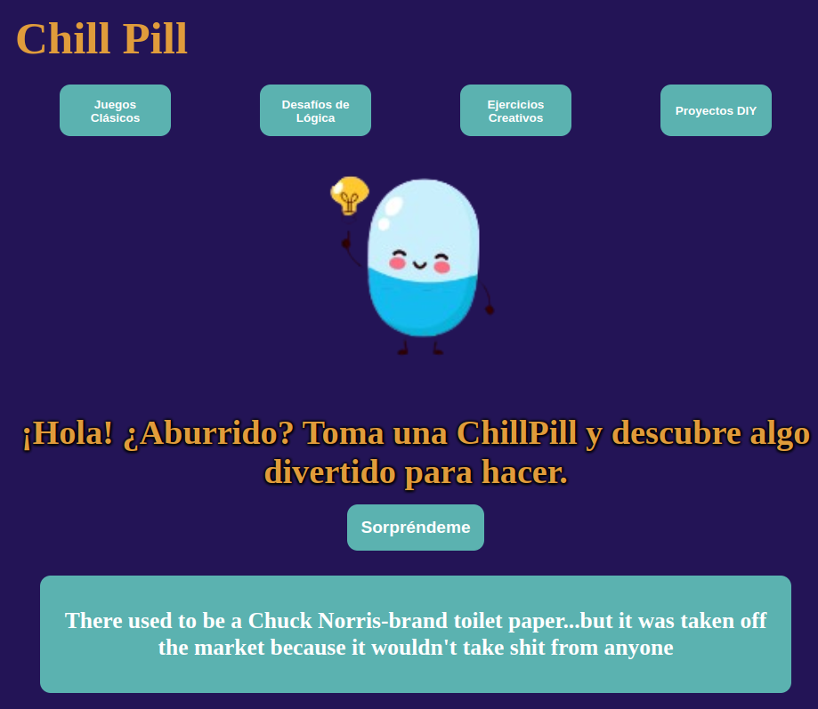

# Chill Pill  
Chill Pill es una aplicación web creada con Svelte para ofrecer actividades divertidas y creativas a las personas que buscan combatir el aburrimiento. Al hacer clic en "Sorpréndeme", la app sugiere una actividad aleatoria o una frase divertida de Chuck Norris.

Aunque inicialmente estaba planeado usar la [Bored API](https://bored-api.appbrewery.com/) para las sugerencias de actividades, he optado por utilizar la [Chuck Norris API](https://api.chucknorris.io/) directamente, implementando una API en Vercel para manejar las solicitudes.

## Vista previa de la aplicación  
  


## Enlaces Útiles  
- **Diseño en Figma**: [Ver diseño](https://www.figma.com/design/IWcxhcdCVVLnWD2o5eKw2u/Chill-Pill?node-id=0-1&node-type=canvas&t=sByL9MaZBpwaPiGT-0)  

- **Aplicación en Vercel**: [Ver aplicación](https://chill-pill-a1jx7vmhn-jhoanavicentes-projects.vercel.app)

- **Tablero de Trello**:  [Ver el progreso en Trello](https://trello.com/b/q5W49Uvb/prova-frontend-hackato-salo-ocupacio).  

## Requisitos 
- Node.js (v14 o superior)
- Git  

## Tecnologías Utilizadas  
**Frontend**: Svelte  
**Estilos**: CSS  
**API**: [Chuck Norris API](https://api.chucknorris.io/)  
**Proxy Server**: Express, Axios, y Cors (para manejar CORS y llamadas API)

## Instalación  
1. Clonar el repositorio: 
```bash
git clone https://github.com/JhoanaVicente/chill_pill.git
cd chill_pill
```
2. Instalar las dependencias:  
```bash  
npm install
```  

3. Ejecución en desarrollo:  
```bash  
npm run dev  
```  
## Herramientas Recomendadas  
Si usas Visual Studio Code, se recomienda instalar la extensión oficial de Svelte para mejor soporte de sintaxis y sugerencias de código.  

## Uso de la API  
Este proyecto utiliza una API alojada en Vercel para manejar las solicitudes a la Chuck Norris API, eliminando la necesidad de un servidor proxy.  